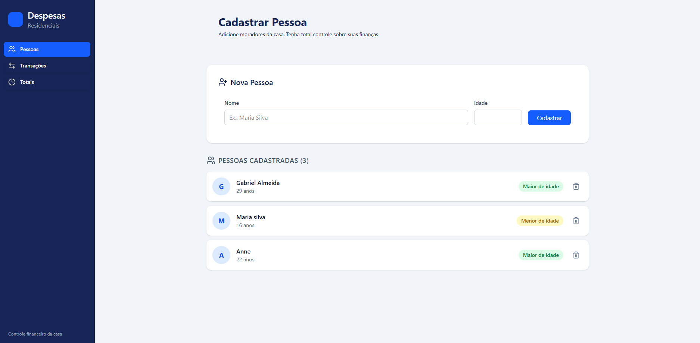
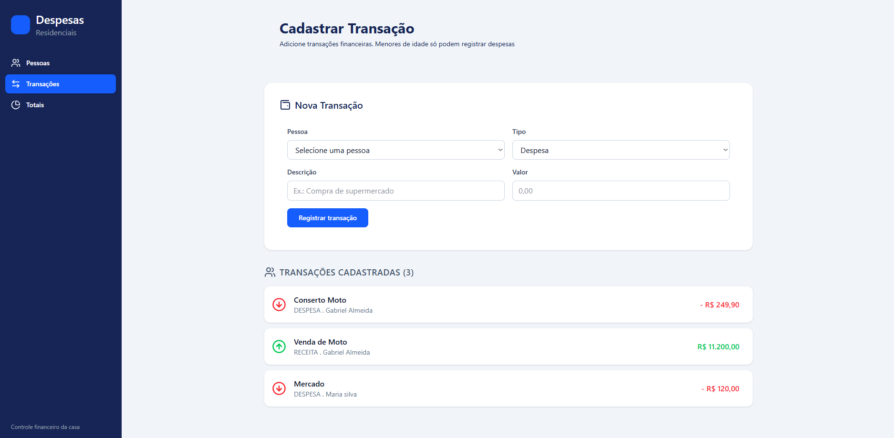
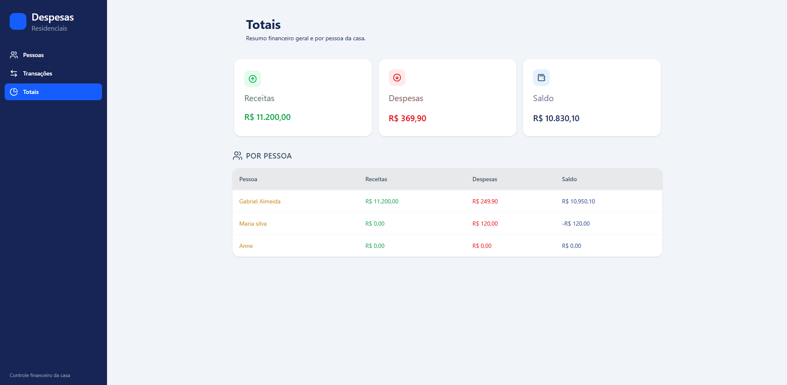

# Controle de Gastos Residenciais

Aplicação web para controle de gastos residenciais, com cadastro de pessoas, cadastro de transações e consulta de totais por pessoa e geral.

## Tecnologias

- .NET
- C#
- Entity Framework Core
- SQLite
- React
- TypeScript

## Funcionalidades do Backend

- Cadastro de pessoas
- Listagem de pessoas
- Busca de pessoa por ID
- Remoção de pessoa
- Cadastro de transações
- Listagem de transações
- Busca de transação por ID
- Consulta de totais por pessoa
- Consulta de total geral

## Regras de Negócio

- Pessoa possui nome e idade.
- Transação possui descrição, valor, tipo e pessoa vinculada.
- O tipo da transação deve ser `receita` ou `despesa`.
- A pessoa informada na transação precisa existir.
- Pessoas menores de 18 anos só podem ter transações do tipo `despesa`.
- Ao remover uma pessoa, suas transações também são removidas.
- O saldo é calculado por `total de receitas - total de despesas`.

## Como Rodar o Backend

Entre na pasta do backend:

```bash
cd backend
```

Restaure os pacotes:

```bash
dotnet restore
```

Aplique as migrations para criar o banco de dados:

```bash
dotnet ef database update
```

Rode a API:

```bash
dotnet run
```
A API estará disponível em `http://localhost:5109`.

## Testando a API
O arquivo `backend/backend.http` contém exemplos de requisições para testar os principais fluxos da aplicação.`

Rotas da API:
- `GET /pessoas` - Listar pessoas
- `GET /pessoas/{id}` - Buscar pessoa por ID
- `GET /transacoes` - Listar transações
- `GET /transacoes/{id}` - Buscar transação por ID
- `GET /totais` - Consultar total geral

- `POST /pessoas` - Cadastrar pessoa
- `POST /transacoes` - Cadastrar transação

- `DELETE /pessoas/{id}` - Remover pessoa

## Rodando o Frontend

Entre na pasta do frontend:

```bash
cd frontend
```

Instale as dependências:

```bash
npm install
```

Em seguida rode a aplicação:

Localmente, a aplicação estará disponível em `http://localhost:5173`.
```bash
npm run dev
```

Para rodar em ambiente de produção, utilize:

```bash
npm run build
```

# Telas da Aplicação

## /Pessoas - Cadastro e listagem de pessoas
[](./img/pessoas.png)

## /Transacoes - Cadastro e listagem de transações
[](./img/transacoes.png)

## /Totais - Consulta de total geral
[](./img/totais.png)